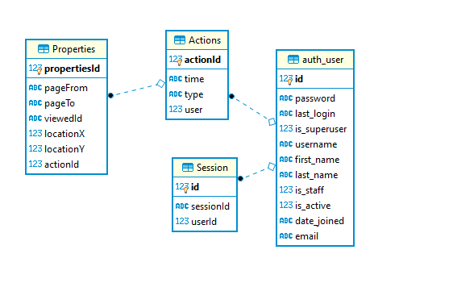

# BackendTest
# Author: Zuofu Li

## if you have anything do not understand, please let me know. thanks

# Instructions:  
1. git clone https://github.com/Chrisfufu/BackendTest.git  
2. virtualenv env  
3. env\Scripts\activate  
4. cd BackendTest  
5. pip install -r requirements.txt  
6. python manage.py runserver  

## there is already a user for you to test on it. id = 1, it is admin user
## username: admin, password: admin  

# it has three urls  

  - it views all the users with all of the futures.  
    http://127.0.0.1:8000/api/users  

  - it can create sample log.  
    http://127.0.0.1:8000/api/user/create/  

  - it can view one user by filter the primary key.  
    http://127.0.0.1:8000/api/user/pk/  

# Follow Up Question  
for the cloud-scalable problem, first of all, I suggests we stored procedures.
I used "with transaction.atomic()" to make sure if part of the data is trying to
to the database and occurs an error, then abort the whole process.
The technology I am using for backend is called Django Rest Framework. it can support
cloud-scalable requests. For example, Instagram, YouTube are using Django as part of
their backend, process requests and backend logic. we also could expand the application
horizontally or vertically, which will make the application faster. Vertically means
that we could change a more powerful machine. horizontally means that we could split
the application by different machines.
Of course, there are libraries that allows us to use Django on a cloud-scalable
application, like Django Storages.

# Follow Up Question  
1. it is well tested  
2. there is a file call "mockdata.json", when you go to link 2, copy from the json file,
   and paste to the json block on the page, then click post.  
3. yes, the data stored efficiently.  
4. The nice thing about Django Rest Framework is that it does give the status code
   automatedly.  
5. Yes, the code is deployable on Heroku. I did set it up.  

# Idea:  
Personally I created a Template for any website project. frontend is using React & Redux,
Backend is using Django Rest Framework. https://github.com/Chrisfufu/DjangoReactTemplate.git
This template allows user just fill in the blank. it took me a long time to configure it.
I used my Template to create this backend test, and removed the frontend part.  
# database design:  
Based on the sample log, I do believe that I only need 3 more tables to store the information
that frontend send back. the ER diagram is shown below.

